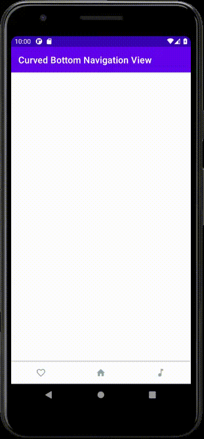

# Meow Bottom Navigation


A simple & curved & material bottom navigation for Android.  


  

  
## Download  

build.gradle (module path)  
```groovy  
dependencies {  
   implementation 'com.etebarian:meow-bottom-navigation:1.0.4' 
```  
  
## Usage  
Add Meow Bottom Navigation in xml <br>
Before this change to RelativeLayout
```xml  
<com.etebarian.meowbottomnavigation.MeowBottomNavigation
    android:id="@+id/bottom_nav"
    android:layout_width="match_parent"
    android:layout_height="wrap_content"
    android:layout_alignParentBottom="true"
    app:mbn_backgroundBottomColor="#ffffff"
    app:mbn_countBackgroundColor="#ff6f00"
    app:mbn_defaultIconColor="#90a4aa"
    app:mbn_selectedIconColor="#3c415e"
    />
    
 ``` 
Declare MeowBottomNavigation
```java
public class MainActivity extends AppCompatActivity {
    MeowBottomNavigation navigation;
....
```

Add menu items in code.  
```java
navigation = findViewById(R.id.bottom_nav);

navigation.add(new MeowBottomNavigation.Model(1, R.drawable.favourite));
navigation.add(new MeowBottomNavigation.Model(2, R.drawable.home));
navigation.add(new MeowBottomNavigation.Model(3, R.drawable.music));

```
Remember that icons must be vector drawable.   
 
  
## Listeners  
```java  
bottomNavigation.setOnClickMenuListener(new MeowBottomNavigation.ClickListener() {  
    @Override  
  public void onClickItem(MeowBottomNavigation.Model item) {  
        // your codes
  }  
});  
  
bottomNavigation.setOnShowListener(new MeowBottomNavigation.ShowListener() {  
    @Override  
  public void onShowItem(MeowBottomNavigation.Model item) {  
        // your codes
  }  
});  
  
bottomNavigation.setOnReselectListener(new MeowBottomNavigation.ReselectListener() {  
    @Override  
  public void onReselectItem(MeowBottomNavigation.Model item) {  
        // your codes
  }  
});
```
  
## Counter Badge 


Setting One Tab  
```java  
bottomNavigation.setCount(TAB_ID, STRING) 
```
EXAMPLE: set 3 count on first icon
```java
bottomNavigation.setCount(1, "3"); 
```

  
## Set Default Tab  
Use this function  
```java
navigation.show(1,true);  
```
